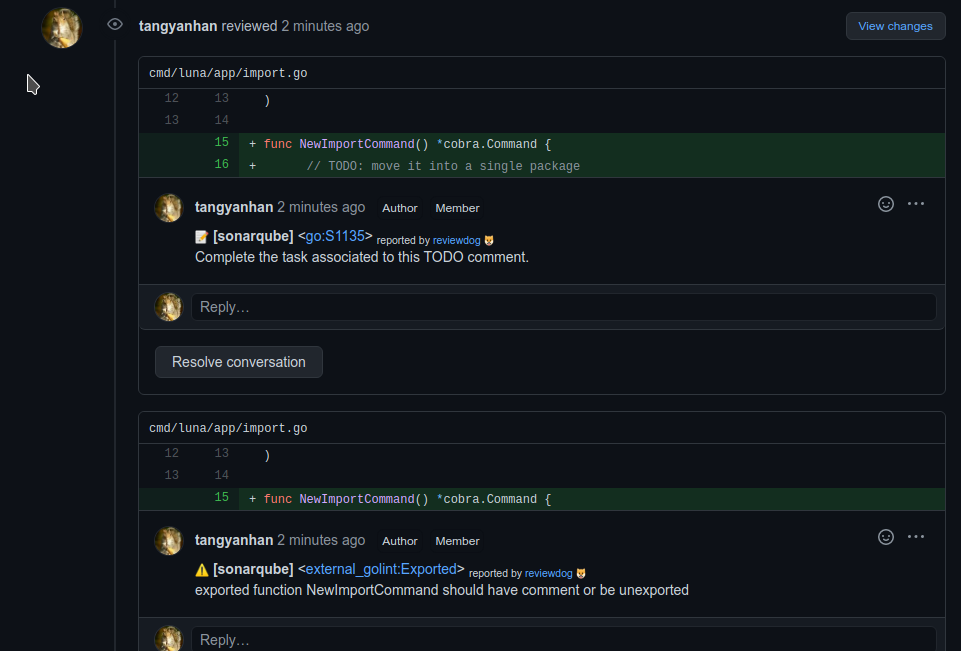

# whale: Comment sonar results in your Pull Request

```
Why named whale? Because whale uses sonar.
```

用于将sonarqube扫描结果以评论形式插入到Github/Gitlab等的PR Review中。

# Install

```
go get -u github.com/beacon/whale/cmd/sonarlint
```

# Run

```
sonarlint --host http://localhost:19000 --token $SONAR_TOKEN --project $SONAR_PROJECT | reviewdog -f=rdjson -reporter=local -diff="git diff master"
```

## Github PR review

```
# Suppose your repo looks like: github.com/owner/myrepo, and you opened a pr request numbered 14:
export CI_PULL_REQUEST=14
export CI_REPO_OWNER=owner
export export CI_REPO_NAME=myrepo
export CI_COMMIT=$(git rev-parse HEAD)
export REVIEWDOG_GITHUB_API_TOKEN=<your github token with comment privilege>
sonarlint --host http://localhost:19000 --token $SONAR_TOKEN --project $SONAR_PROJECT | reviewdog -f=rdjson -reporter=github-pr-review
```



## Gitlab PR review

```
export CI_PULL_REQUEST=14
export CI_REPO_OWNER=owner
export export CI_REPO_NAME=myrepo
export CI_COMMIT=$(git rev-parse HEAD)
export REVIEWDOG_GITLAB_API_TOKEN="<token>"
export GITLAB_API="https://example.gitlab.com/api/v4"
export REVIEWDOG_INSECURE_SKIP_VERIFY=true # set this as you need to skip verifying SSL
sonarlint --host http://localhost:19000 --token $SONAR_TOKEN --project $SONAR_PROJECT | reviewdog -f=rdjson -reporter=github-pr-review
```
